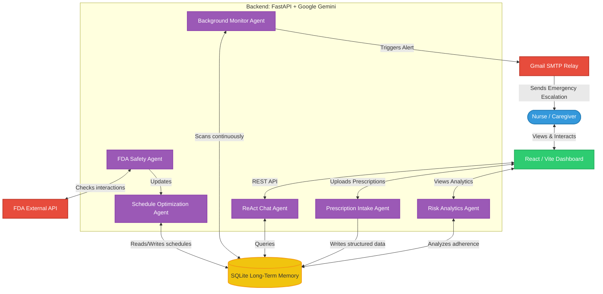
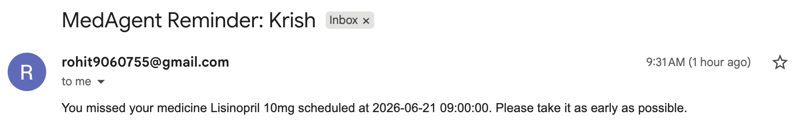

# MedAgent AI: Autonomous Remote Patient Monitoring (RPM) Dashboard

**A Google + Kaggle 5-Day Course Capstone Project**

## Project Overview
Medication non-adherence is a massive problem in healthcare, costing billions of dollars and leading to severe patient complications. Traditional reminder apps rely heavily on manual data entry and assume the patient will faithfully log their adherence. 

**MedAgent AI** solves this by introducing an **Agentic AI Swarm architecture**. It is designed as a **Remote Patient Monitoring (RPM) Dashboard** for nurses and care coordinators. Instead of forcing a human nurse to manually call dozens of different patients every day to check if they took their pills, MedAgent AI autonomously monitors all patients simultaneously. It handles complex prescription structuring, schedule generation, safety checks, and emergency caregiver escalations—all without human intervention.

## The Agentic Swarm Architecture
This platform moves beyond basic LLM chatbots by employing multiple specialized, autonomous agents that collaborate in the background to form a cohesive Swarm:



1. **Intake Agent:** Parses messy, unstructured prescription text (or images), normalizes drug names, extracts exact dosages, and structures the data autonomously into the database.
   * *Example: A nurse pastes "Amoxicillin 500mg PO TID x10 days". The agent extracts the drug, route, frequency, and duration, converting "TID" into exactly 3 doses per day.*
2. **Safety Agent:** Instantly cross-references external FDA databases in the background to ensure newly added medications do not cause deadly interactions with a patient's existing regimen.
   * *Example: If a patient is on Warfarin, and Ibuprofen is added, the agent flags an extreme bleeding risk and halts the schedule generation until physician override.*
3. **Scheduler Agent:** Dynamically builds a perfect 24/7 daily schedule, interpreting complex medical shorthand.
   * *Example: Converts "Take at bedtime" and "Take with food" into a precise 9:00 PM and 8:00 AM timeline avoiding drug-drug timing conflicts.*
4. **Side-Effect Agent (RAG):** When a patient logs a symptom, this agent autonomously retrieves the FDA label via a Retrieval-Augmented Generation pipeline to flag if a specific drug is causing the symptom.
   * *Example: Patient logs "Dizziness". The agent pulls the FDA API and notes that Losartan commonly causes dizziness upon standing.*
5. **Analytics Agent:** Constantly monitors patient compliance to calculate a live Adherence Grade and an overall Clinical Risk Score.
   * *Example: If a patient misses 3 consecutive doses of a critical heart medication, their Clinical Risk Score spikes to "High", pushing them to the top of the dashboard.*
6. **Monitor Agent:** The true autonomous watchdog. It runs silently on a background schedule. If a patient misses a critical medication or logs a severe side effect, the AI reasons about the risk level and autonomously dispatches an emergency **Caregiver Alert** via Email.
   * *Example: An elderly patient misses their morning Lisinopril. The agent evaluates the risk as moderate and sends a summary email to their registered daughter.*

## Dual-Memory Architecture
A true agentic system requires memory. MedAgent AI implements a production-grade dual-memory architecture:
*   **Long-Term Shared Memory (Stateful):** Instead of relying on a fragile LLM context window to remember patient data over weeks, the Swarm uses an external SQLite database as Long-Term Memory. The Intake agent writes a prescription to memory, and a week later, the Monitor agent reads from it.
*   **Short-Term Conversational Memory:** The ReAct Chat Assistant uses traditional Conversation History Arrays to maintain context, allowing users to ask complex follow-up questions seamlessly.

## Key Features
- **Multi-Patient Dashboard:** Designed for care coordinators. The "Risk Dashboard" automatically surfaces the highest-risk patients to the top.
- **Autonomous Emergency Escalation:** Real-time email dispatch to caregivers if a critical dose is missed.
- **ReAct Chat Assistant:** A conversational agent that has direct access to the live SQLite database and external FDA endpoints, capable of answering queries like *"What are Jane's adherence grades and does her medication cause nausea?"*
- **Live Tooltips & Modern UI:** A beautiful, responsive React frontend.

## Visual Tour

### 1. The Multi-Patient Risk Dashboard

> *The AI autonomously grades patient adherence and calculates a live clinical risk score to prioritize care.*

### 2. Autonomous Daily Scheduling

> *The Scheduler Agent dynamically generates a personalized 24/7 medication schedule.*

### 3. Medication Tracking & Safety Tooltips

> *The Safety Agent cross-references the FDA database to instantly surface interactions and critical warnings.*

### 4. Live Adherence Analytics

> *The Analytics Agent constantly monitors compliance to generate dynamic 14-day trends and medication-specific adherence charts.*

### 5. ReAct AI Chat Assistant

> *The chat assistant possesses real-time access to the SQLite database to answer complex medical questions about the patient's routine.*

### 6. Autonomous Emergency Escalation (Email Alerts)

> *When a critical medication is missed, the Caregiver Agent autonomously dispatches an emergency email with a clinical summary to the registered emergency contact.*

## 🎮 Try It Out (For Judges & Evaluators)
If you are evaluating this project, follow these steps to experience the Agentic Swarm firsthand!

1. **Add a Patient & Prescription:** Go to the "Add Prescription" tab and paste a messy clinical note like: *"Patient John Doe needs Metformin 500mg twice a day with meals."* Watch the Intake Agent structure it instantly.
2. **Test the Safety Guardrails:** Try adding a drug that interacts dangerously with what the patient is already taking (e.g., Warfarin + Aspirin). See the Safety Agent block it.
3. **Simulate Adherence:** Go to the "Daily Schedule" and mark a few critical medications as "Skipped".
4. **View the Escalation:** Check the Risk Dashboard to see the patient's Clinical Risk Score spike to "High". If configured, watch the Monitor Agent fire off an emergency email.
5. **Query the Swarm:** Go to the "AI Chat" tab and ask: *"Which of my patients are high risk today and what medications did they miss?"* Watch the agent query the SQLite memory and give you a perfect answer.

## Tech Stack
- **AI Models:** Google Gemini Flash Lite (for fast, cost-effective reasoning) and Gemini Pro.
- **Backend:** Python, FastAPI, SQLite (Live database tools for the AI).
- **Frontend:** React, TypeScript, Vite.
- **Notification Routing:** SMTP Email Gateways.

## Local Installation & Quick Start

### 1. Clone the Repository
```bash
git clone https://github.com/YOUR_USERNAME/MedAgent-AI.git
cd MedAgent-AI
```

### 2. Setup Backend (FastAPI + AI Agents)
```bash
cd backend
python3 -m venv venv
source venv/bin/activate
pip install -r requirements.txt
cp .env.example .env # Add your Google Gemini API Key and SMTP credentials
uvicorn main:app --reload
```

### 3. Setup Frontend (React + Vite)
Open a new terminal window:
```bash
cd frontend
npm install
npm run dev
```

## Deployment Instructions

For production deployment, we recommend a split-tier architecture:

### Deploying the Backend (Google Cloud Run)
1. Ensure your `backend/` directory contains a `Dockerfile` and `requirements.txt`.
2. Install the [Google Cloud CLI](https://cloud.google.com/sdk/docs/install).
3. Authenticate and set your project:
   ```bash
   gcloud auth login
   gcloud config set project YOUR_PROJECT_ID
   ```
4. Deploy directly from source:
   ```bash
   cd backend
   gcloud run deploy medagent-backend --source . --allow-unauthenticated
   ```
5. Note the generated URL.

### Deploying the Frontend (Vercel or Netlify)
1. Push your code to GitHub.
2. Go to Vercel (or Netlify) and import the repository.
3. Set the Root Directory to `frontend`.
4. Add an Environment Variable: `VITE_API_URL = [YOUR_CLOUD_RUN_URL]`.
5. Click **Deploy**.

---
*Developed for the Google + Kaggle 5-Day Generative AI Capstone.*
